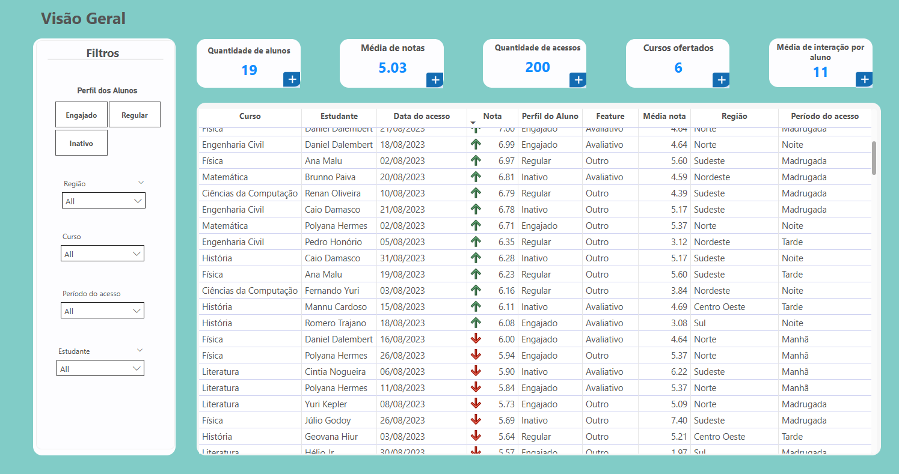
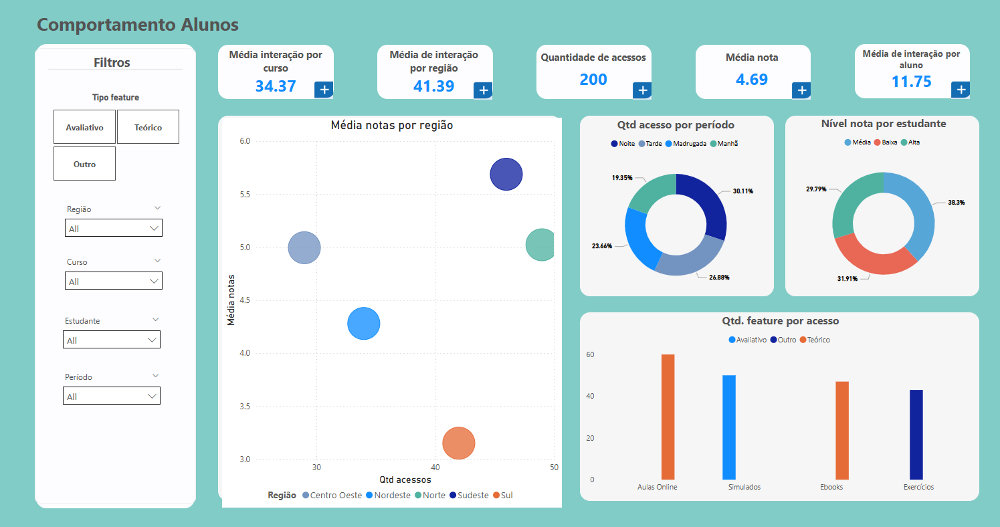
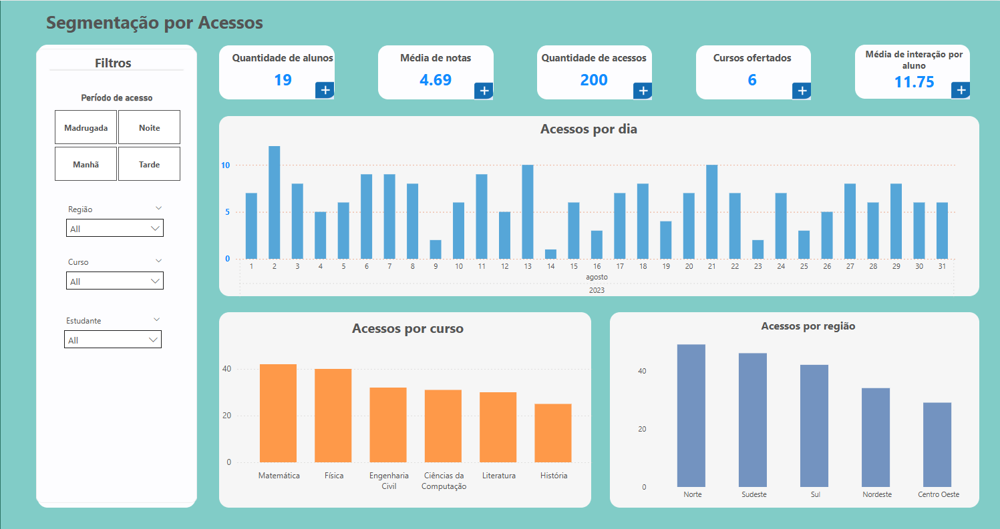
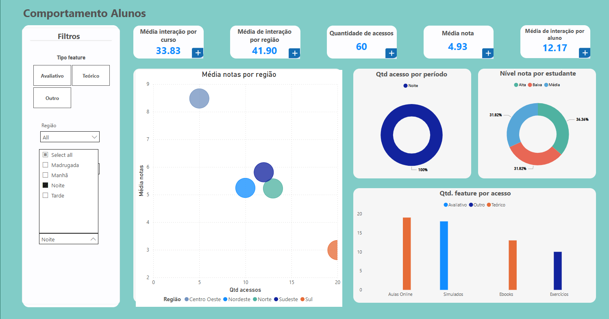
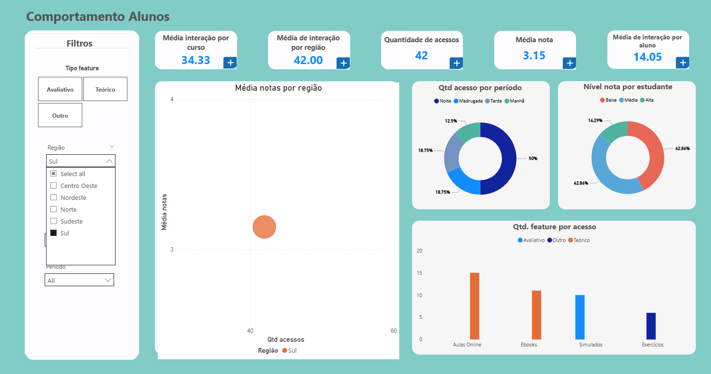
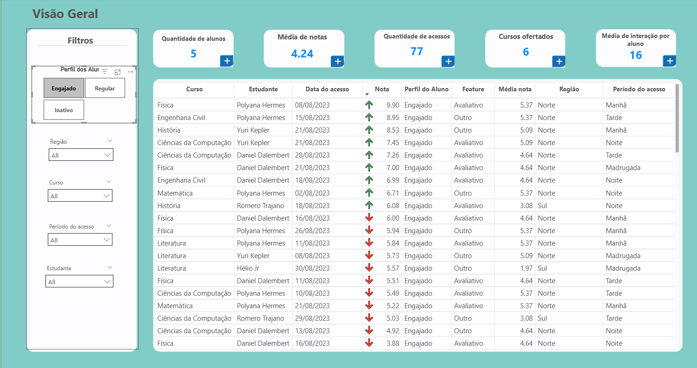

# Análise de LMS (Learning Management System)

 
Este projeto utiliza dados de interação com um LMS para explorar padrões de uso, engajamento dos alunos e desempenho.
Criando uma pipeline simples para transformação e segmentação das informações.

[Baixar relatório Power BI (.pbix)](relatorio/analise.pbix)

## 📊 Objetivos

- Tratar dados e criar campos a partir dos existentes para uma melhor análise
- Segmentar alunos por desempenho e tipo de conteúdo
- Criar campos calculados do comportamento dos alunos
- Implementação de cluster e previsão de churn para identificar padrões e treinar dados

## 🛠️ Tecnologias

- Python
- Power BI
- Linguagem DAX

## 🛠️ Funcões

### `normaliza_data(df)`

- Combina as colunas de **Data** e **Hora** em uma única coluna `data_hora` do tipo datetime.
- Cria a coluna `dia_semana` com o nome do dia da semana (ex: Segunda-feira, Terça-feira, etc.).
- Cria a coluna `periodo`, categorizando o horário do acesso em:
  - `Manhã`: 06h às 11h59  
  - `Tarde`: 12h às 17h59  
  - `Noite`: 18h às 23h59  
  - `Madrugada`: 00h às 05h59

### `normaliza_notas(df)`

- Trata os valores da coluna `Nota` (em string com vírgula) para número decimal.
- Cria a coluna `nota_valida` para identificar se a nota é numérica ou nula.
- Classifica as notas em três categorias na coluna `nivel_nota`:
  - `Baixa`: nota < 4  
  - `Média`: nota ≥ 4 e < 7  
  - `Alta`: nota ≥ 7  

- Categorização da coluna `Feature` em tipos:
  - `Avaliativo`: simulados  
  - `Teórico`: eBooks, aulas online  
  - `Prático`: exercícios  
  - `Outro`: demais categorias

### `comportamento_aluno(df)`

- Calcula a quantidade de interações por:
  - Estudante (`interacoes_estudante`)
  - Curso (`interacoes_curso`)
  - Região (`interacoes_regiao`)

- Adiciona colunas com:
  - `primeiro_acesso` e `ultimo_acesso` por estudante
  - `tempo_desde_ultimo` acesso (em dias)
  - `dias_ativos` (número de dias únicos com acesso)
  - `media_nota_estudante` (média das notas numéricas)

### 📊 Segmentação de Alunos por Perfil

 - Técnicas de Machine Learning para segmentar alunos com base no engajamento e desempenho

 O script aplica o algoritmo de **K-Means Clustering** para identificar perfis de alunos a partir de três variáveis principais:
- Média de notas do estudante
- Número de interações na plataforma
- Dias ativos

Os alunos são agrupados em três perfis:
- **Inativo**
- **Regular**
- **Engajado**

A função `segmentar_alunos_por_perfil()` retorna um DataFrame com a nova coluna `perfil_aluno`.

### 🔮 Previsão de Churn (Risco de Evasão)

Foi implementado também um modelo preditivo de churn utilizando **Random Forest Classifier** com as seguintes variáveis:
- Interações do estudante
- Dias ativos
- Média de notas

O churn é considerado quando o aluno não acessa a plataforma há 2 dias ou mais. O modelo retorna uma estimativa de risco (`churn_risco`) entre 0 e 1.

> A função `prever_churn_alunos()` insere essa estimativa no DataFrame final.

## Observações Importantes

- Este projeto foi construído a partir de uma base de dados pequena e fictícia, portanto, **os resultados não devem ser considerados definitivos**. É essencial ter um volume maior de dados para garantir maior **precisão** e **robustez** das análises.

- Por essa razão, a **função de churn não foi aplicada diretamente** no pipeline principal do projeto, sendo apresentada aqui apenas como uma proposta inicial de modelagem.

## Recomendações baseadas em insights dos dados

1. Aumentar atividades práticas nos horários de pico

 

     - Existem um alto número de acessos no período da noite, com foco em conteúdo teórico.
     - Seria interessante incluir mais atividades práticas e avaliações rápidas

2. Aumentar suporte em regiões com menor engajamento

    - A região Sul se encontra com uma alta quantidade de acessos, mas as notas são baixas. Pois consomem mais conteúdos teóricos. 
    - Investigar o que pode está acontecendo, investir em campanhas de engajamento para os outros tipos de atividades ou oferecer suporte personalizado.

3. Personalizar conteúdo com base no perfil de engajamento

    - Alguns alunos classificados como engajados (medidos pela média de notas, número de interações e dias ativos), ainda aparecem com notas baixas. 
    - Entender mais profundamente a causa e criar trilhas personalizadas que equilibrem teoria, prática e avaliação.
